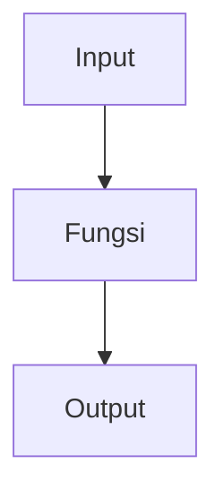

## Intro

For the next little while, I'll be writing a series about FP / Functional Programming. Mainly from a frontend perspective. This time, I'll explain functional programming using a deductive approach, where we'll discuss the key points or important concepts in functional programming before eventually talking about FP as a whole. In this part, let's talk about Pure Functions

## What Is a Pure Function

Okay, so first we'll discuss something pretty simple: pure functions. Pure functions have several characteristics, as listed below.

### The output will always be the same if the input doesn't change



A pure function is basically like a machine in a factory: it consistently produces the same output as long as its input (the material) doesn't change either. Let's say we have the function below:

```javascript
function double(x) {
  return x*x;
}
```

even if we run that function over and over, the same input will always produce the same value:

```javascript
console.log(double(5));
// 25
console.log(double(5));
// 25
console.log(double(5));
// 25
console.log(double(5));
// 25
```

### A Pure Function has no side effects

A Side Effect is when a function changes the value of another variable from within that function. For example:

```javascript
let x = 5;
function double() {
  x = x * x;
  return x;
}
```

that function changes the value of x in an outer variable. This also means the function's output keeps changing when it's called repeatedly, even though its input (which in this case is empty) doesn't change.

```javascript
console.log(double());
// 25
console.log(double());
// 625
```
