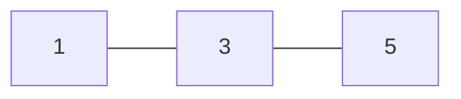
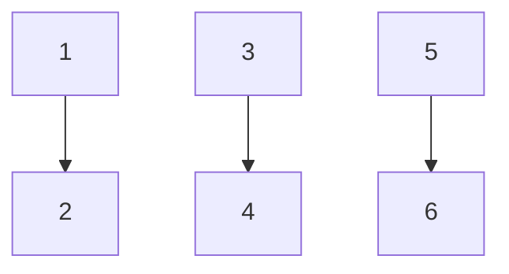

So in this article, we're going to talk about Functors. If you're learning functional programming, you'll definitely run into this term once or twice. I just had my own "eureka" moment yesterday about what a functor actually is. Functional programming terms tend to be so complicated that they're often hard to understand and not very accessible. For example, what's the formal definition of a Functor? Let's check Wikipedia:

> In [functional programming](https://en.wikipedia.org/wiki/Functional_programming), a **functor** is a [design pattern](https://en.wikipedia.org/wiki/Design_pattern) inspired by [the definition from category theory](https://en.wikipedia.org/wiki/Functor), that allows for a [generic type](https://en.wikipedia.org/wiki/Generic_type) to apply a [function](https://en.wikipedia.org/wiki/Function_(mathematics)) inside without changing the structure of the generic type.

Well, there you go. You look up the definition of something, only to find something else whose definition you don't know either. Category theory comes from mathematics, if I'm not mistaken. But who has time to study math just to understand a programming concept? 

But that doesn't mean a Functor is just some impractical supernatural creature. In fact, we've almost certainly used Functors in our everyday lives. Don't believe me? You use Array when coding in JS, right? Well, Array is a Functor.

This is proof that we don't actually need to know the theory to use a concept in the real world, but understanding the concept lets us explore it further and even apply it to other things. So let's try to understand Functors.

In my opinion, the simplest definition of a Functor is:

> A data structure (or type) that can be mapped

Simple, right? Can Array be mapped? Yes. So there you go, an array is a Functor. It's that simple. But what exactly is mapping?

##  Mapping

Okay, so a Functor is a data structure that can be mapped, like an array. But what exactly is the Mapping process?

Some people I've asked said that Mapping means changing data into other data. Hmm, that's not quite right. After all, another word for "changing" in programming is "mutating." Meanwhile, according to the FP holy book, data mutation is forbidden and can get you excommunicated from FP. 

Even if we look at JavaScript itself, `Array.prototype.map` doesn't change the value of the Array. For example:

```javascript
const initialArr = [1, 3, 5];
initialArr.map(v => v * 2);
console.log(initialArr);
// [1, 3, 5]
```

See, the value of `initialArr` doesn't change, right? That's why, if we want to use the mapped value, we have to assign it to a new variable like below

```javascript
const initialArr = [1, 3, 5];
const doubledArr = initialArr.map(v => v * 2);
console.log(doubledArr);
// [2, 6, 10]
```

So what should we call Mapping? For me, it's simple: just translate it literally as "plotting." 

Imagine that `initialArr` is on a number line A.



Mapping means we plot this number line onto a new number line. Now, to do that, we need some rules, right? How do we want to map it? `Function` passed as the parameter to `.map`is what determines the rules. For example, in the code above, the rule is that we map the number line `initialArr`, onto a new number line where every value in `initialArr` is mapped to a value-twice-as-large-as-itself on that new number line.



Using the data type `number` or `integer` here is just meant to make things easier to understand, but of course we can do many other things with `.map`. But the important point is that `mapping` doesn't change either the structure or the values of the data structure being `map`, but instead `membuat garis bilangan baru` which, of course, means we can assign that new number line to a new variable.

## Creating Our Own Functor Data Structure

JS already has Array, so now that we know about Functors, what are they useful for?

Applying the concept to other things, of course. Say we're building a game app. To make tracking scores easier, let's create a data structure called `ScoreList`. Then we'll turn this ScoreList into a Functor so we can easily map the players' scores:

```javascript
/*
  Function Score List value accept the following structure
  {
    [personName: string]: score
  }
*/
function ScoreList(value) {
   this.value = value;
}

ScoreList.prototype.map = function(fn) {
  const personKeys = Object.keys(this.value);
  const result = {};
  personKeys.forEach(name => {
     result[name] = fn(this.value[name]);
  });
  return result;
}
```

Let's test it:

```javascript
const scores = new ScoreList({
  me: 10,
  you: 20,
  him: 30,
})

const doubleScore = (x) => x * 2;
const multipliedScore = (multiplier) => (x) => x * multiplier;

console.log(scores.map(doubleScore));
/*
{
  him: 60,
  me: 20,
  you: 40
}
*/
console.log(scores.map(multipliedScore(5)))
/* 
{
  him: 150,
  me: 50,
  you: 100
}
*/
console.log(scores.value);
/*
{
  him: 10,
  me: 20,
  you: 30
}
*/
```

Now we can easily map each player's score to a new value without changing the value of the variable `scores` itself. At this point, you might be thinking, that's a hassle—why do we have to access it through `scores.value`? And the mapped value returned by this map function can't be chained into another map, right? Yeah, that's because I cheated a little: our current .map function returns `plain javascript object`instead of the ScoreList data structure we created. I made it that way above to keep things easier to understand.

Now let's extend our data structure so we no longer need to access it through `scores.value` and so the value of `map` returns `ScoreList` and can be mapped again. Awesome, right?

```javascript
/*
  Function Score List accept the following structure
  {
    [personName: string]: score
  }
*/
function ScoreList(value) {
   const keys = Object.keys(value);
   keys.forEach((key) => {
     this[key] = value[key];
   });
}

ScoreList.prototype.map = function(fn) {
  const personKeys = Object.keys(this);
  const result = {};
  personKeys.forEach(name => {
     result[name] = fn(this[name]);
  });
  return new ScoreList(result);
}

const scores = new ScoreList({
  me: 10,
  you: 20,
  him: 30,
})

const doubleScore = (x) => x * 2;
const multipliedScore = (multiplier) => (x) => x * multiplier;

console.log(scores.map(multipliedScore(5)));
/* 
{
  him: 150,
  me: 50,
  you: 100
}
*/
console.log(scores.map(doubleScore).map(doubleScore));
/*
{
  him: 120,
  me: 40,
  you: 80
}
*/
console.log(scores);
/*
{
  him: 10,
  me: 20,
  you: 30
}
*/

```

Pretty neat, right? Here, we store the score directly as if it were a regular object, without needing to access it through the property `.value`. On top of that, the result of `map` returns the ScoreList data type itself, so yeah, you can keep mapping and chaining it until you run out of memory if you want.

By creating a mappable data type like this, we can perform mappings and get values based on a function without changing the original value. Why would we need that? For one thing, this approach can minimize bugs where we want to get a mapped value but accidentally change the original one instead. And by leaving the original value unchanged, we can also make debugging easier and get cool features like `undo` for free and efficiently.

Oh yeah, if you noticed, I used another functional programming concept above to create the function `multipliedScore`. In FP, this is called `currying` or `partial application` what is that? Stay tuned for the next article!
