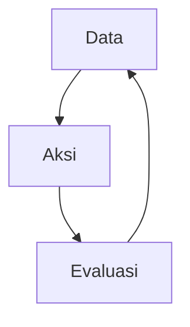

Before going any further, I want to add a little *disclaimer* so this doesn't turn into a *blunder*. this piece is merely an opinion written by someone who isn't an activist, and even calling myself a former activist would feel like a stretch. basically, this is just the opinion of someone who may not be all that competent when it comes to activism. 

In this piece, I want to share my thoughts on how social movements can thrive in the digital era, or the era known as the *four-point-o* era.

## Industry 4.0: Challenge or Opportunity ?

First, I want to discuss whether this digital trend, or Industry 4.0, is an opportunity or a challenge. The answer may well be both. 

Why is it a challenge ? There's no denying that digital trends are developing incredibly fast. Especially since the pandemic, which has demanded all sorts of changes in human activities, including how organizations operate. This becomes a major challenge when the level of *Digital Literacy* among these social movement cadres is very low, partly because they were slow to adapt. over the past two or three years, we have often still seen organizations that are reluctant, or even opposed, to seriously developing their media and their cadres' digital literacy.

This is a very serious problem because times have changed. Twentieth-century movements were dominated by people who could deliver speeches from a podium and write well for newspapers. Perhaps what twenty-first-century movements need today are people who can create an awesome YouTube *channel* or capture moments through photography that then goes viral on social media.

The difference may be that, in the past, the people who had the power to create change were also the ones with the spirit to take part in movements. There was a natural progression from becoming educated, to being able to read and write, and then to developing the awareness to take action. In other words, the awareness to take action was preceded by the ability to produce writing that ultimately changed the times.

The big question is, Can the same writing methods and styles still raise awareness among the general public ?

If those methods have become outdated. Do the social movement cadres who possess this awareness also have the skills needed to change the times ?

If the answer to the first question is "YES" and the answer to the second is "NO". then social movements urgently need to equip their cadres with those skills. 

So how can social movements achieve that goal ?

## The Stages

### Stage One: Creating a Data Pipeline

In today's digital era, data is incredibly important.  there's even a saying, *Data is the new oil* or data is the new oil. that's how valuable data is. almost every company, from startups to multinational corporations, applies data-driven organization and decision-making.

The question isn't just whether social movements have carried out "Data Collection". but how the data itself is processed. Raw data that cannot be "studied" is nothing more than a pile of useless information.

That's why social movements also need to create a data pipeline, which usually starts with data collection and data cleaning / cleansing before ultimately producing conclusions.

For example, suppose a social movement wants to create a data pipeline or database about the level of *Digital Literacy* among its cadres.

The first thing to do is actually ask, what should the desired data look like ? Say the social movement wants to divide digital literacy into 4 levels: technologically illiterate (knows nothing at all), aware, proficient, and productive. then we define them, for example:

- Aware: Cadres are considered aware of digital technologies, from the most common ones such as word processing applications (typing), cloud services, and e-meeting tools such as Zoom, etc. and at the very least, they understand the basics of those technologies. for example: they can join an online meeting on Zoom/Google Meet
- Proficient: Cadres are considered proficient when they can apply and combine digital technologies at a more advanced level, such as creating and managing online training using the available technology options.
- Productive: Cadres are considered capable of producing when they have one of the digital literacy skills that the social movement needs. examples include photography, graphic design, and programming. and within the productive stage, we can dig deeper into the data by dividing this section into 3 parts:
  - Beginner: The cadre at least has an interest in the field or has just started learning it.
  - Intermediate: The cadre can produce work under the supervision/direction of an expert cadre
  - Advanced/High: Capable of producing work independently or leading a production team

From the database concept above, we can then create instruments to collect the required data, such as questionnaires, surveys, or interviews, ultimately giving us raw data.

The raw data that has been collected is then processed both quantitatively, in the form of statistics and figures, and qualitatively, as a general picture of the social movement's state of digital literacy. Only then can the data generate recommendations about what should be done. this allows the social movement to act based on valid data that has been clearly processed.

### Stage Two: Making a Plan

Of course, data is useless without real action. So, based on the conclusions drawn from the data, the social movement needs to determine the right steps.

For example, we can categorize a social movement's level of readiness for the digital world or its digital literacy into 3 stages:

- Not Ready: Most cadres are only at the aware stage or are even still technologically illiterate. therefore, especially in a pandemic era like this, the efficiency and outcomes of activities or cadre development programs will be minimal
- Ready: Most cadres are at the proficient stage, allowing activities and cadre development programs to achieve the right outcomes efficiently because the cadres can design technology-based activities or cadre development programs.
- Innovation: Most cadres are at the productive stage, so besides running activities that meet their targets as if there were no pandemic, the social movement can produce new innovations that maximize existing outcomes or even create new ones.

Suppose the data shows that 90% of the movement's cadres are only at the aware level. that means only 10% are at least proficient, and that 10% is likely concentrated in a particular group/branch. At this stage, the social movement is essentially paralyzed, and the outcomes of its activities or cadre development programs will decline compared with the period before the pandemic.

At this stage, the solution is to improve digital literacy by creating something like a very basic guidebook, even if cadres who are already capable might find it trivial. for example, the book (which could of course be in digital/PDF format) could contain instructions for downloading Zoom, creating a meeting room, using cloud features in word processing, etc.

### Stage Three: Taking Action and Collecting New Data

Basically, these stages form a cycle. data becomes a plan, the plan becomes action, and measurements of that action can become new data and calibrate the old data, which then leads to a new plan, and so on.

## The Digital Movement Concept: Startups Within the Movement

Once the "Raw Materials" are available, such as cadres who are already capable of producing digital products, I think we can create several initiatives. the concepts and recipes below are, of course, just my personal opinion. I think we can build small startups within the movement. Startup doesn't mean we already have to be professional or create something that is already a legal entity, but at the very least, we should intend to create something professional by conducting clear market analysis and research, making plans, and carrying out evaluations. once again, these startups must also be data-driven. 

### Digital Media

#### Digital Media Against the Challenges of the Times: The Generation Has Changed

Our generation has changed, and the people who consume media in general have shifted to millennials and Generation Z. One common trait of Generation Z, which now dominates the internet, is that they don't like things that are too heavy. and they like products with good brands/packaging or tend to follow certain popular figures.

So, our homework when we want to create digital media isn't simply whether the platform has articles or not. it's also about who writes them and what their writing style is like. Branding becomes extremely important, perhaps even more important than the presence of the articles themselves.

The problem is, cadres in these movements very rarely succeed in becoming pop-culture figures or influencers. so it may be rather difficult to brand the media around the presence of an influencer cadre.

Meanwhile, these movement cadres usually tend to write in convoluted language whose meaning is anyone's guess. just to sound cool and look like they've been reading social theory or philosophy books, you know. 

Heavy Issues + Heavy Language, when you combine them, well, just imagine how Generation Z will react when they already dislike heavy stuff to begin with. so these cadres probably need to set their egos aside and write in language that isn't fancy but is at least easier to understand. 

Digital media must have a clear vision and market. so its writers must adapt to the level of understanding of the market that has been chosen.

Besides writing, several other instruments or tools also need to be prepared. for example, today, photos, videos, and design are extremely important. we often see that visuals in the form of photos or videos have far more potential to go viral.

So we need cadres who can capture moments using good photography/videography techniques. Once the photo/video has gone viral, it seems like viewers will read pretty much any narrative written alongside it.

we also need an instrument called SEO (Search Engine Optimization). or, put simply, it's about getting our writing to rank highly in searches on search engines such as Google. the higher the ranking, the more likely our media's articles are to appear on the first page.

We can also add instruments such as FB Ads/Instagram Ads. actually, in the right hands, we don't need to spend a lot of money for our articles to reach the right target audience.

We also need skilled graphic designers. that way, non-news writing such as essays can have good, consistent illustrations.

### E-Commerce / Marketplace

Besides literacy media. The digital initiatives created could also take the form of an e-commerce platform or marketplace where fellow cadres can at least buy and sell through the platform. This would create a semi-closed platform that indirectly brings together and helps market the cadres' work.

An effort like this was once made, for example, by PC IMM AR Fakhruddin with its online shop: http://kedai.pcimmarfakhruddin.org/, which unfortunately has not operated to its full potential because of various obstacles. But with greater urgency and awareness, perhaps an initiative to create a similar platform could work well and reach its full potential, especially if managed professionally

### Integrating the Branding of the Movements/Startups We Create

Last but no less important, the initiatives we create should not be sporadic. because that would be very damaging from various perspectives, whether from a market perspective, where we would have to create a new market, or from a technical perspective, where the resulting SEO Ranking would also drop if, for example, the literacy media brand and the e-commerce brand were not under the same umbrella.

A good case study we can look at is Mojok.co. when it wanted to expand into printed literature in the form of books, Mojok created a publishing house but named the brand "Buku Mojok". it then created an online store called "Mojok Store". and when it created a more open writing platform, Mojok made "Mojok Terminal", which is even hosted on the same domain as mojok.co, at https://mojok.co/terminal/

Companies such as Gojek have made similar efforts. when it wanted to expand from online motorcycle taxis into food delivery and laundry services, it kept everything within one platform and integrated branding.

Social movements should learn proper branding practices like the startups or companies above. PC IMM AR Fakhruddin actually once applied this concept as well, bringing creative minorities and startups such as its shop together under a single domain, https://pcimmarfakhruddin.org . more about the concept used at the time can be read in the following article: https://medium.com/@hanifeij/from-a-to-z-of-poros-merah-dan-masa-depan-sistem-informasi-pc-imm-ar-fakhruddin-579e1b66bf00

## Closing

That's the author's opinion. basically, social movements need to go through several stages to prepare themselves for the Industry 4.0 era. starting with the smallest things, such as collecting data.

Then small startups need to be created within the organization. Even large organizations/companies such as Google have startups within their companies. Social movements have actually known the concept of startups for a long time, because a startup can basically also be understood as a creative minority. It simply has a clearer structure and greater professionalism.

Once again, this piece is merely an opinion that could, of course, very well be proven wrong.
