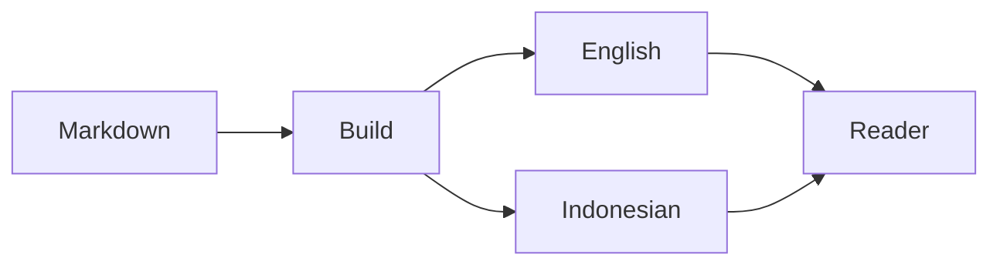

import InteractiveCounter from './InteractiveCounter.astro';
import YouTube from '@components/mdx/YouTube.astro';
import Tweet from '@components/mdx/Tweet.astro';

Most articles only need headings, links, and a few code examples. Keeping that default simple matters. When an explanation needs more, MDX lets one post import a component without turning the entire site into an application.

## Code stays readable

Astro uses Shiki at build time, so a TypeScript block arrives as highlighted HTML instead of shipping a syntax highlighter to every reader.

```ts
type Locale = 'en' | 'id';

function postUrl(locale: Locale, slug: string) {
  return `/${locale}/blog/${slug}/`;
}
```

Names such as `Locale`, `postUrl`, and `slug` must remain unchanged in a translation.

## Diagrams are still Markdown

The diagram below begins as an ordinary fenced Mermaid block. The translation tool treats the complete block as protected source.



## A component for one idea

This counter lives next to this post. It is not registered globally and it does not add a UI framework to the project.

<InteractiveCounter />

Shared components work the same way. For example, a privacy-enhanced YouTube embed can be imported from the shared MDX component directory.

<YouTube id="dQw4w9WgXcQ" title="Example YouTube embed" />

An X post keeps a normal link as its fallback when the external widget is blocked.

<Tweet url="https://x.com/jack/status/20" />
