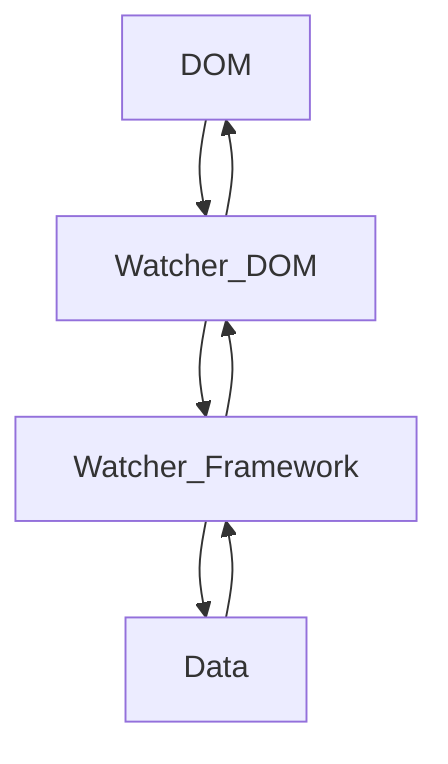
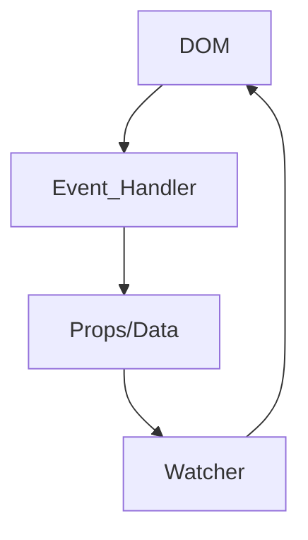
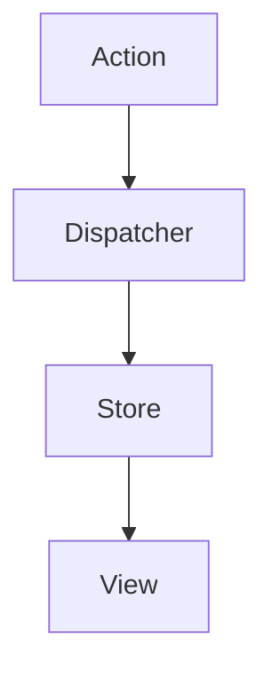
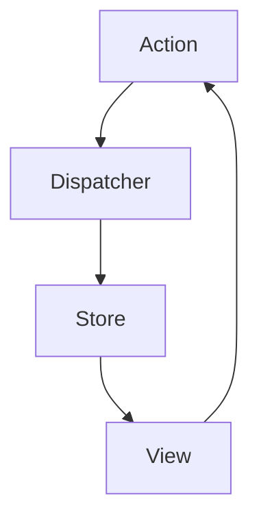

In this post, we'll discuss things related to React, such as one-way data binding, Flux architecture, etc.

### One-Way Data Binding
In general, React uses the one-way data binding paradigm. First, let's discuss what data binding means. Data binding is the process of integrating data or props from the JS/React world into the Browser/HTML world. Some frameworks use two-way data binding, which looks roughly like this:



As you can see, there are separate watchers monitoring data in the framework and data/events in the DOM. So when one of them changes—when there's some input, for example—the data in the JS/framework world changes too. With this method, we hardly ever need to manually add events to the DOM. Here's an example (not an actual framework):
```html
<input value={someModelFromFramework}>
```
The problem with this kind of architecture is that the bigger our application gets, the more watchers get attached, since each element needs two watchers.

React has used one-way data binding from the start, which looks roughly like this



As shown in the diagram above, in the React environment, the DOM doesn't have direct access to the props/data in the React environment. When we want to change data in props/state, it has to go through an event handler like the one below (this example uses a class component to make it easier to understand):

```js
class MyInput extends React.Component {
  state = {
    value: '',
  };

  updateValue = (value) => {
    this.setState({ value });
  }

  render() {
    return (
      <input onChange={(e) => this.updateValue(e.target.value)} />
    )
  }
}
```
That's what one-way data binding means in React.

## Flux Architecture and Unidirectional Data Flow
So what does Flow Architecture mean? As we discussed above, "One-Way Data Binding" is *a way to think* or a paradigm. Of course, there are many ways to achieve it. Flux is one blueprint for managing data using "One-Way Data Binding." Flux follows Unidirectional Data Flow, with a diagram that looks like this



Let's discuss the diagram above, starting from the bottom. The View is the UI in the form of HTML, or you can think of it as a React component. The View displays the data from the store, and when the store changes, the View rerenders to match the data in the store. But keep in mind that the View cannot update the store directly, so it needs an action:



An Action is a payload or piece of information that will then be processed by the Dispatcher. The Dispatcher is a function that receives information and updates the store, and every change to the store ultimately causes the View to rerender with the new data.

## What's the Difference Between Flux and MVC? (Flux = Strict MVC)
Are Flux and MVC actually different? Conceptually, they're really the same. That's because proper MVC also has a strong separation of modules between the model, view, and controller. The view gets data from the model, but it cannot update the model directly—it has to go through the controller. So *in a way* strict MVC has a one-way data flow.

But in reality, things changed in the frontend or JavaScript world. Unlike the days of server-side rendering with things like PHP, when moving to another page or adding something to a webpage would reload the whole page, client-side rendering has AJAX, going all the way back to when jQuery was still popular.

The problem with MVC on the frontend is that the data flow becomes two-way. For example, say we have a model in some JS framework. The View (an HTML element such as an input, for example) can directly change the data in that model without going through an event. This was the original problem that eventually led Facebook to create React: their chat system, which initially used MVC, had problems scaling.

In React, every data change to state or props has to go through an event and be updated declaratively. This brings us to the next topic: Declarative programming—what is it?

## React and Declarative UI
So, what exactly does declarative mean, and how is it different from imperative programming?
Declarative programming focuses on statements or declarations and hides the process. Imperative programming, meanwhile, focuses on the process, so it tends to be longer. 
Take the source code below, for example
```javascript
const myArray = [];
for (let i = 0; i < 10; i+=1) {
  myArray.push(i);
}
```
The code is pretty simple. It adds the numbers 0 through 9 to an array. How can we make it more declarative? We can abstract that process into a function—let's say we call the function tambah array:
```javascript
function tambahKeArray(arr,nilaiMinimum,nilaiMaximum) {
  const returnedArr = [...arr];
  for (let i = nilaiMinimum; i < nilaiMaximum; i+= 1) {
    returnedArr.push(i);
  }
  return returnedArr;
}
const myArray = [];
tambahKeArray(myArray, 0, 9);
```
Now, if you look at it, the second piece of code is clearer, right? For this case, it might look longer. But because we've already created the function, whenever we want to perform that process again, we only need to call the "tambahKeArray" function. So declarative programming gives a process a name, making it clearer.

So what does that have to do with the frontend? Well, back in the jQuery/vanilla JS days, you probably often did something like this to handle fetching data from the server
```javascript
// init loading
document.querySelector(".someSelector").innerHtml = 'Loading...'
fetch("https://example.com").then(resp => resp.json()).then(data => {
  const text = data.text
  document.querySelector(".someSelector").innerHtml = text;
});
```
Well, there we're going through the process of editing the HTML content of an element. How can we make it more declarative?
```javascript
function updateElementContent(selector, content) {
  document.querySelector(selector).innerHtml = content;
}
// init loading
updateElementContent(".someSelector", "Loading...");
fetch("https://example.com").then(resp => resp.json()).then(data => {
  const text = data.text
  updateElementContent(".someSelector", text);
});
```
That makes our code clearer, doesn't it? It shows that what we're doing is updating the content of an element. It also minimizes typos or, if the process is long, reduces the chance of forgetting to add one or two steps, because all the steps have been wrapped in a function.

So why is React called a declarative framework? Because React hides many processes and gives us interfaces to work with. For example, how do we do something when an element first appears? Lifecycle methods are provided. How do we update state? We're given the function interface `setState`. And if we don't look at React's source code, we might not even know how React updates a state behind the scenes.

Would you folks be interested in discussing it?
