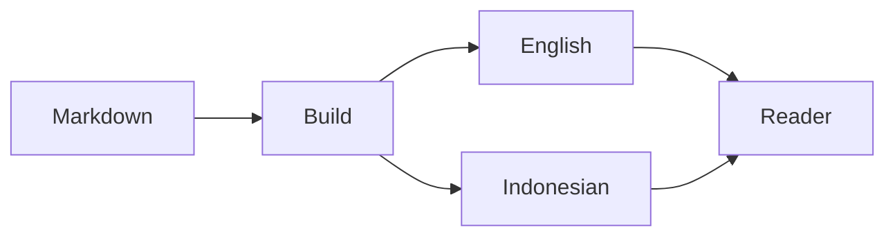

import InteractiveCounter from './InteractiveCounter.astro';
import YouTube from '@components/mdx/YouTube.astro';
import Tweet from '@components/mdx/Tweet.astro';

Kebanyakan artikel cuma butuh heading, link, dan beberapa contoh code. Menjaga format dasarnya tetap sederhana itu penting. Saat sebuah penjelasan butuh lebih dari itu, MDX memungkinkan satu tulisan mengimpor component tanpa mengubah seluruh situs menjadi aplikasi.

## Code tetap enak dibaca

Astro memakai Shiki saat build, jadi blok TypeScript sudah sampai sebagai HTML yang di-highlight tanpa mengirim syntax highlighter ke setiap pembaca.

```ts
type Locale = 'en' | 'id';

function postUrl(locale: Locale, slug: string) {
  return `/${locale}/blog/${slug}/`;
}
```

Nama seperti `Locale`, `postUrl`, dan `slug` harus tetap sama dalam terjemahan.

## Diagramnya tetap Markdown

Diagram di bawah ini berasal dari fenced Mermaid block biasa. Tool penerjemah memperlakukan seluruh blok tersebut sebagai source yang dilindungi.



## Component untuk satu ide

Counter ini tinggal di sebelah file tulisan ini. Ia tidak didaftarkan secara global dan tidak menambahkan UI framework ke project.

<InteractiveCounter />

Shared component bekerja dengan cara yang sama. Contohnya, embed YouTube yang lebih menjaga privasi bisa diimpor dari direktori shared MDX component.

<YouTube id="dQw4w9WgXcQ" title="Contoh embed YouTube" />

Post dari X tetap punya link biasa sebagai fallback kalau widget eksternalnya diblokir.

<Tweet url="https://x.com/jack/status/20" />
