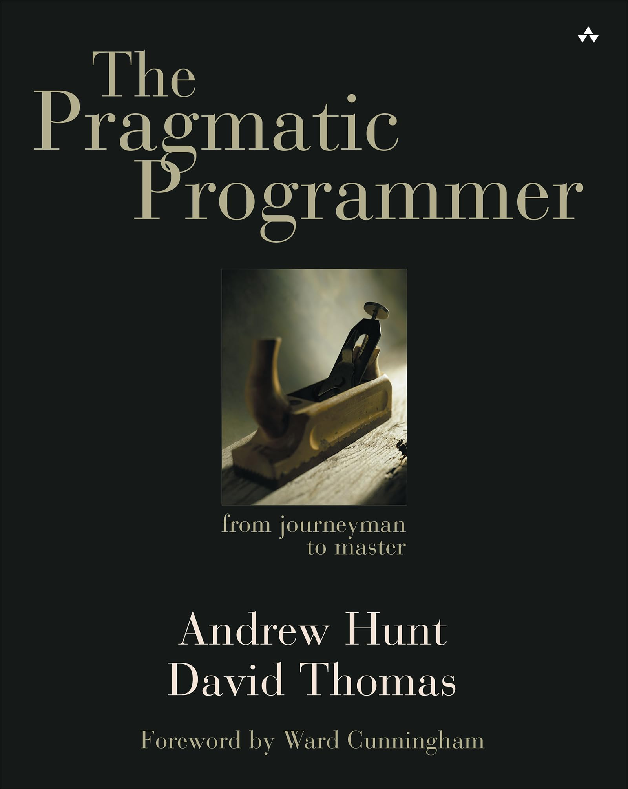
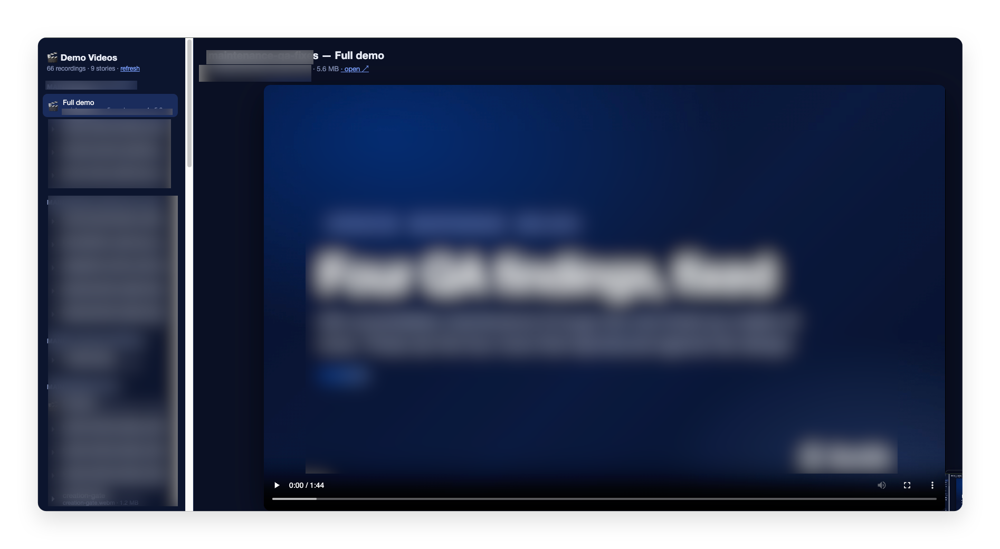
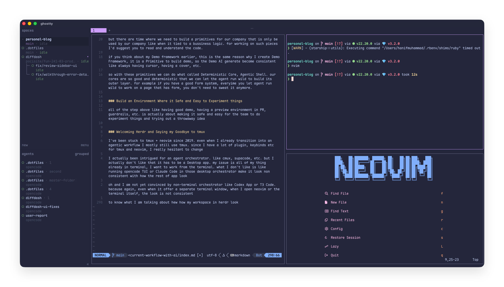
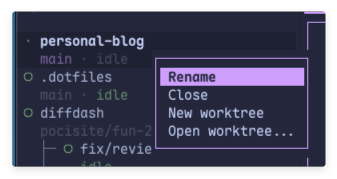
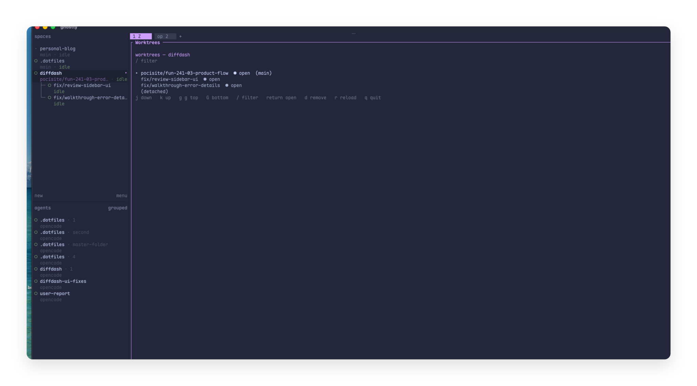
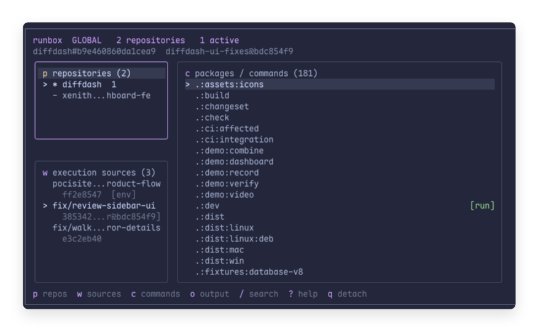

import Tweet from '@components/mdx/Tweet.astro';
import YouTube from '@components/mdx/YouTube.astro';

Cara saya mengadopsi AI sebenarnya agak aneh, saya terlambat memulai dan lambat beradaptasi.

pada 2024 teman saya memposting percakapan grup kami ke X, saat saya bilang masih sepenuhnya coding secara manual dan belum yakin dengan AI,
postingan itu mendapat cukup banyak balasan dan orang-orang pada dasarnya menyebut saya dinosaurus.

atau kalimat itu, oh iya, kalimat itu: "Dia akan digantikan oleh orang yang menggunakan AI". untungnya setelah 2 tahun hal itu tidak terjadi.

Jadi untuk AI, saya baru benar-benar ikut ketika Agentic Engineering mulai jadi tren, saya tidak memakai AI untuk tab / autocomplete.
Interaksi pertama saya dengannya adalah menggunakan Claude Sonnet dengan Cursor. tapi saat itu saya belum sepenuhnya berkomitmen/yakin. Saya masih lebih sering coding secara manual

Tapi saya benar-benar terjun ke Agentic Engineering ketika Claude Opus 4.5 dirilis. di situlah saya mulai yakin bahwa ini memang sesuatu yang nyata.

jadi fase saya sebenarnya seperti ini

- Awal Mengadopsi AI
- Mulai Menggunakan AI Setiap Hari dan Mencari Tahu Batasannya
- Era Psikosis AI
- Fase Bekerja dengan AI Saat Ini

## Awal Mengadopsi AI

yang ini sebenarnya tidak begitu menarik, saya jarang melakukan agentic engineering.
Saya lebih sering memakainya untuk hal-hal sekali pakai atau sesuatu di codebase yang tidak terlihat oleh end user, seperti dev tool.

## Mencari Tahu Batasannya

di sinilah semuanya mulai menarik, karena saya mulai menggunakan Claude Code setiap hari. dan mulai membangun banyak hal. Saya membuat MCP untuk design system, mencoba FIGMA MCP, bahkan membuat AI Browser sendiri. tapi pada era ini saya juga belum sepenuhnya yakin, terutama karena Claude/GPT saat itu sepertinya sangat buruk dalam urusan desain dan tidak pandai menggunakan Figma MCP
Saya punya tulisan yang lebih mendetail tentang ini, [Sisi Kasar AI Agent Saat Ini untuk Frontend Development](/id/blog/rough-edges-of-current-state-of-ai/), dan kalau tertarik, kalian bisa membacanya di sana

## Era Psikosis AI

sebenarnya di sini tidak banyak yang berubah dari cara saya bekerja di kantor. tapi secara pribadi, saya menggunakan AI terlalu banyak, benar-benar terlalu banyak. selama beberapa bulan saya menghabiskan 2 akun Claude Max 20x, belum termasuk Claude Team yang saya dapat dari kantor. Saya rasa ini topik untuk lain hari

## Cara Saya Bekerja Sekarang

Mungkin ini juga bisa disebut era waras, ketika saya sudah tidak menggila dengan AI, tapi juga tidak melupakan semua yang sudah saya pelajari.

Saya sudah yakin bahwa Agentic Engineering memang sedang terjadi dan akan tetap menjadi cara sebagian besar dari kita bekerja di masa depan. Sekarang saya jarang coding dengan tangan sendiri. bahkan sangat jarang.

tapi saya juga tidak 100% yakin seperti sebagian orang bahwa kita bisa memiliki software factory tanpa manusia. tempat AI mengerjakan hampir semuanya dan manusia sama sekali tidak terlibat, bahkan tidak mereview code yang dihasilkan AI.

Menurut saya kita perlu sedikit memperlambat langkah. Saya juga sadar bahwa ketika saya melambat dan benar-benar membaca code dari AI, banyak di antaranya ternyata masih asal-asalan. jadi sekarang saya bahkan membuat tool code review sendiri bernama [DiffDash](https://usediffdash.com).

### Mereview atau tidak mereview, bukan itu pertanyaannya

beberapa hari lalu ada postingan viral di X tentang apakah kita masih perlu membaca code atau tidak. Saya cukup takjub ternyata ada orang yang menghujat mereka yang masih membaca code.

tapi apakah kita perlu membaca code? Saya termasuk programmer yang cukup tua, dan dulu saat belajar ada sebuah buku rekomendasi berjudul The Pragmatic Programmer



Saya tidak akan membahas isi bukunya, tapi yang ingin saya sampaikan adalah setelah membaca buku itu, saya menjadi lebih pragmatis dalam melihat berbagai hal. soal membaca code ini, pendapat saya: baca code yang penting, tidak perlu membaca semuanya.

sekarang saya tidak akan memberi tahu code atau bagian mana dari software kalian yang penting. kalian sendiri yang menentukan, dan untuk code atau bagian software yang memang penting, bacalah code-nya.

dengan sebanyak itu output yang kita hasilkan menggunakan AI, membaca seluruh code sudah tidak masuk akal. itu memperlambat kita.

Saya membuat devtool untuk sebuah app di kantor yang memungkinkan orang mengaktifkan/menonaktifkan feature flag. Saya tidak peduli dengan code-nya, saya hanya memastikan code tersebut terpisah dari code app. Saya tinggal menyuruh Claude mengerjakannya berulang kali sementara saya mengerjakan tugas sendiri.

nah, yang ini sebenarnya sedikit bernuansa. karena meskipun terkadang code-nya tidak berada di area yang digunakan user, kita tetap perlu membaca/mengarahkan bagian inti atau interface-nya jika itu sesuatu yang ingin terus kita tingkatkan atau maintain.

Menurut saya ini lebih mudah dijelaskan lewat contoh.

Saya membuat framework perekaman video demo untuk app di kantor, yang memungkinkan AI melakukan seed data dan menghasilkan video secara offline secara otomatis. lalu muncul pertanyaan tentang bagaimana video itu dibuat, apakah menggunakan remotion, menggunakan playwright, bagaimana agent berinteraksi dengan program yang membuat video tersebut? apakah agent menggunakan dan mengoperasikan playwright mcp secara langsung atau dengan cara lain.

Yang saya temukan ternyata bukan hanya manusia yang senang berinteraksi dengan desain API yang bagus, agent juga. akhirnya saya membuat sebuah framework demo yang memungkinkan kita menghasilkan video menggunakan script. dan berikut contoh script-nya

```tsx
export const diffDash043Story = defineStory({
  id: "diffdash-0.4.3",
  title: "DiffDash 0.4.3 Release",
  intro: {
    step: "",
    eyebrow: "DiffDash · Desktop Release",
    title: "Release 0.4.3",
    caption:
      "Sharper review navigation, clearer walkthrough paths, and the complete desktop review workflow.",
  },
  outro: {
    step: "",
    eyebrow: "DiffDash · Desktop Release",
    title: "That’s a wrap",
    caption:
      "Seven focused workflows. One place to understand every change before it ships.",
  },
  clips: [
    clip(
      "1-repository-discovery",
      {
        step: "01",
        eyebrow: "Repositories",
        title: "Find & Bookmark Repositories",
        caption:
          "Search beyond saved work and keep important repositories one click away.",
      },
      [
        click({
          button: "Remove bookmark for emberline/dispatch",
          exact: true,
        }),
        type(
          {
            placeholder: "Search bookmarked and accessible repositories",
            exact: true,
          },
          "emberline/dispatch",
        ),
        waitFor({ button: "Bookmark", exact: true }),
        annotate(
          { button: "Bookmark", exact: true },
          "Accessible repositories appear in the same search and can be saved immediately.",
          { title: "Repository discovery", placement: "left", hold: 3_200 },
        ),
        click({ button: "Bookmark", exact: true }),
        pause(1_100),
      ],
    ),
    clip(
      "2-scoped-navigation",
      {
        step: "02",
        eyebrow: "Review Navigation",
        title: "Search the Active Workspace",
        caption:
          "Go Anywhere now follows the active Files or Walkthrough sidebar.",
      },
      [
        ...openReview(),
        press(reviewActions, "Meta+k"),
        waitFor({ placeholder: "Search files", exact: true }),
        annotate(
          { placeholder: "Search files", exact: true },
          "With Files active, Go Anywhere searches only the review file inventory.",
          { title: "Active sidebar", placement: "bottom", hold: 3_000 },
        ),
        press({ placeholder: "Search files", exact: true }, "Escape"),
        click(walkthroughButton),
        waitFor({ text: "Review focus", exact: true }),
        press(walkthroughButton, "Meta+k"),
        waitFor({ placeholder: "Search walkthrough sections", exact: true }),
        annotate(
          { placeholder: "Search walkthrough sections", exact: true },
          "Switch to Walkthrough and the same shortcut searches walkthrough sections instead.",
          { title: "Scoped navigation", placement: "bottom", hold: 3_300 },
        ),
        pause(700),
      ],
    ),
    // some other clips
    clip(
      "7-local-review",
      {
        step: "07",
        eyebrow: "Local Review",
        title: "Review Before You Push",
        caption:
          "Open working-tree changes and merge-base branch comparisons from the DiffDash CLI.",
      },
      [
        release("navigation-working-tree"),
        waitFor(
          { role: "heading", name: "Local changes", exact: true },
          15_000,
        ),
        annotate(
          { role: "heading", name: "Local changes", exact: true },
          "Tracked and untracked working-tree changes open directly as a complete local review.",
          { title: "Working tree", placement: "bottom", hold: 3_100 },
        ),
        click(walkthroughButton),
        waitFor({ text: "Review focus", exact: true }),
        pause(900),
        release("navigation-branch-diff"),
        waitFor(
          { role: "heading", name: "Changes vs dev", exact: true },
          15_000,
        ),
        annotate(
          { role: "heading", name: "Changes vs dev", exact: true },
          "Branch comparisons use the merge base, so unrelated target-only changes never pollute the review.",
          { title: "Merge-base comparison", placement: "bottom", hold: 3_500 },
        ),
        raw("hold final branch review", async ({ page }) =>
          page.waitForTimeout(900),
        ),
      ],
    ),
  ],
});
```

Saya menyebutnya story file. jadi sebuah demo terdiri dari story + clips. kalian bisa menggunakan kembali clips di story lain jika diperlukan. sekarang, dalam project saya di kantor, agent yang mengelola stories dan clips ini sehingga ia bisa menggunakan kembali apa yang sudah dibuatnya. dan saya juga menambahkan sedikit instruksi agar ia mengisi teks secara perlahan dan menambahkan cursor.

berikut contohnya untuk DiffDash

<Tweet url="https://x.com/hanipcode/status/2084139545894027760" />

jadi untuk hal semacam ini, saya tidak begitu tahu atau peduli dengan bagian dalamnya, saya tidak peduli atau tahu bagaimana kita bisa menampilkan cursor dalam video playwright. tapi saya PEDULI dengan lapisan luarnya, seperti apa API-nya. karena saya tahu agent pun akan senang menulis script dalam framework yang bagus. dan memang begitu.

untuk code sebuah feature atau code yang menurut saya penting dan mungkin perlu saya maintain dalam jangka panjang, saya masih membaca sebagian besar code-nya. Apa maksudnya sebagian besar? ya, terkadang saya cuma membaca sekilas perubahan ui atau string yang sepele.

### Belum Yakin dengan Remote Agent Sandbox, tapi Optimistis dengan Preview env di PR.

Sekarang banyak orang membicarakan bagaimana setiap sesi agent sebaiknya dijalankan dalam remote sandbox agar kita bisa melihat preview semuanya selagi mereka bekerja. sehingga agent tidak saling mengganggu saat bekerja.

diri saya yang lama pada Era Psikosis AI pasti akan sangat bersemangat mendengar ini. tapi karena sekarang saya sudah melambat, saya sebenarnya tidak peduli. toh saya juga tidak punya energi dan rentang perhatian untuk mengelola semuanya.

Sekarang workflow saya di kantor adalah selalu mengerjakan 1 tugas dengan batas waktu, sesuatu yang sudah direncanakan atau dipetakan dan punya timeline seperti sebuah feature atau tugas saya saat ini. lalu, saya membuka 2 git worktree lain, satu saya sebut bugfix git worktree, satunya lagi chore/experiment git worktree.

di bugfix worktree, saya biasanya menyuruh Claude berulang kali mengambil bug dari Jira dan memperbaikinya, atau terkadang kalau saya sendiri mendapat tugas bug, saya akan mengerjakannya di sini.

chore / experiment git worktree bagi saya cukup menarik. jadi selagi AI melakukan coding, biasanya saya memilih tech debt atau masalah developer experience yang sedang saya benci. video demo yang saya sebutkan tadi lahir di sini.

jadi singkatnya, saya tidak terlalu banyak melakukan multi-tasking (setidaknya dalam hal coding), saya jelas hanya mengerjakan 1 feature dalam satu waktu, dan saya menjalankan project / dev di sini.

tapi untuk bugfix, biasanya saya tinggal menyuruh Claude membuka PR, lalu hasilnya akan di-build di vercel preview environment, dan saya memeriksa pekerjaannya di sana. kalau menemukan masalah, saya tinggal menyuruh Claude memperbaikinya lagi, lalu mengeceknya saat punya waktu.

### Video Demo Adalah Cara Saya Mengikuti Semua Hal yang Perlu Direview

sekarang, meskipun saya yakin banyak orang sebenarnya menghasilkan jauh lebih banyak daripada saya, saya masih kewalahan memikirkan cara mereview semuanya.

misalnya dalam bugfix, kalau tidak ada PR preview, saya harus berganti branch lalu menjalankan ulang project. worktree tidak banyak membantu karena kita harus melakukan install lagi, menyalin env, dan banyak hal lain sebelum bisa menjalankan dev server.

inilah alasan saya membuat framework video demo yang disebutkan tadi. sekarang saya sangat sering menonton dan membukanya sampai akhirnya membuat dashboard khusus ini, sekali lagi hanya dengan vibe coding (karena tidak ada user yang akan melihatnya dan saya hanya menggunakannya sendiri)



ini membuat semuanya lebih mudah direview, sebenarnya saya ingin melampirkannya ke PR secara otomatis, tapi menurut saya menjalankan ini pada setiap push di CI akan terlalu mahal bagi saya.

### Mengerjakan Frontend dalam Skala Besar Masih Sulit Sekali Diotomatisasi

kalau kalian membaca tulisan saya tahun lalu tentang berbagai sisi kasar FE, banyak hal sudah diperbaiki, tahun lalu saya bahkan tidak terpikir untuk memiliki video demo

tapi saya masih merasa interaksi AI dengan design tool seperti Figma dan custom design tool masih terasa kaku.

Sekarang AI sudah tidak sesering dulu menghasilkan hal-hal aneh seperti tidak mengikuti props dalam Design System, bahkan menurut saya bagian "Bekerja dengan design system" sudah sepenuhnya terpecahkan. tapi ketika ditambah design tool seperti Figma, bahkan setelah saya memberinya Figma, AI masih sering berhalusinasi seperti tidak membuat layout yang tepat, melewatkan wording, atau dalam beberapa kasus langka malah membuat sesuatu yang bahkan tidak ada di Figma.

Saya tahu sekarang ada Figma Code Connect. tapi setahu saya hanya tersedia untuk organization plan yang sangat mahal.

Saya dengar paper.design sebenarnya bagus. tapi saya belum mencobanya dan perusahaan saya sudah menggunakan Figma.

### guardrails

membuat e2e sekarang murah karena code juga murah. serius, buat saja banyak integration dan e2e test.

### Primitives yang Bagus Itu Penting

Saya banyak terinspirasi oleh tulisan David Mosher, [Deterministic Core, Agentic Shell](https://blog.davemo.com/posts/2026-02-14-deterministic-core-agentic-shell.html).

Di era agentic, kita perlu membangun banyak primitives yang bagus dengan kualitas sangat tinggi. Primitives adalah building block yang bisa kita gunakan untuk membangun software.

contohnya seperti [Diffs](https://diffs.com) dan [Trees](https://trees.software) karya [@pierrecomputer](https://x.com/pierrecomputer).

library-library itu keren sekali. kalian bisa melihat di sini bahwa diffs.com bahkan mampu membuka 30M+ diffs dari perbandingan linux v6 dan v7 https://diffshub.com/torvalds/linux/compare/v6.0...v7.0 dan prosesnya cepat sekali. penulisnya membahas hal itu di sini https://pierre.computer/writing/on-rendering-diffs

tanpa kedua library tersebut, saya tidak akan bisa membangun DiffDash secara efisien. karena DiffDash sangat mengandalkannya agar mampu membuka diff berukuran besar.

hal ini juga penting di tingkat perusahaan. sekarang kita benar-benar perlu berpikir dalam bentuk Primitives. Primitives apa yang dimiliki perusahaan kalian? dan seberapa bagus kualitasnya?

Salah satu contohnya, sekarang memiliki dan membangun Design System menjadi semakin penting. alih-alih hanya melakukan styling code secara inline dengan tailwind untuk mengubah style. Design system yang bagus dan konsisten sangat penting agar Agent bisa membangun tampilan yang konsisten. Sebelumnya saya menyebut Figma, bahkan ketika AI secara acak membuat layout yang salah atau menambahkan hal yang tidak diminta, tampilannya sebenarnya masih konsisten. entah kenapa saat ini AI masih belum bisa memahami Figma secara efektif, tapi ketika nanti sudah bisa, memiliki design system yang bagus akan menjadi jauh lebih penting.

untungnya terkadang generic primitives yang bagus bisa kita serahkan ke pihak lain. misalnya untuk Fetching Library kita bisa menggunakan SWR / Tanstack Query. Nuqs untuk URL state. dan sebagainya. Membangun primitives yang bagus benar-benar membutuhkan keahlian. kalau membaca artikel pierre di atas, kalian akan tahu bahwa dia memang memahami virtualization. karena itu, meskipun code murah, mengandalkan software open source yang bagus tetap menjadi pilihan terbaik. percayalah, membangun primitives yang bagus itu sulit.

tapi ada kalanya kita perlu membangun primitives khusus perusahaan yang hanya digunakan oleh perusahaan kita, misalnya ketika berkaitan dengan business logic. untuk mengerjakan bagian semacam itu, saya menyarankan kalian membaca dan memahami code-nya.

kalau kalian memikirkan Demo framework saya tadi, inilah alasan yang sama mengapa saya membuat Demo Framework, yaitu sebagai Primitive untuk membangun demo, sehingga Demo yang dihasilkan AI menjadi konsisten seperti selalu memiliki cursor, cover, dan sebagainya.

jadi dengan primitives ini, kita bisa menerapkan apa yang disebut Deterministic Core, Agentic Shell. core kita begitu bagus dan deterministik sehingga kita bisa membiarkan agent bergerak bebas membangun lapisan luarnya. misalnya, kalau kalian memiliki Form system yang bagus, setiap kali membiarkan agent bekerja bebas pada halaman yang memiliki form, kalian tidak perlu mengkhawatirkannya lagi.

### Bangun Environment yang Aman dan Mudah untuk Bereksperimen

semua langkah di atas seperti memiliki demo yang bagus, preview environment di PR, guardrails, dan sebagainya, sebenarnya bertujuan membuat eksperimen dan percobaan ide sekali pakai menjadi aman dan mudah bagi tim

### Menyambut Herdr dan Mengucapkan Selamat Tinggal kepada tmux

Saya terus menggunakan tmux + neovim sejak 2019. bahkan setelah beralih ke workflow agentic, saya masih lebih sering menggunakan tmux. karena punya banyak plugin, keybinds, dan sebagainya untuk tmux dan neovim, saya benar-benar ragu untuk pindah

Saya sebenarnya tertarik dengan agent orchestrator. seperti cmux, supacode, dan sebagainya. tapi saya tidak suka karena semuanya harus berupa Desktop app. masalahnya, semua yang saya gunakan sudah ada di terminal, saya ingin bekerja dari terminal. yang tidak saya suka adalah menjalankan opencode TUI atau Claude Code dalam desktop orchestrator tersebut membuat tampilannya tidak konsisten dengan app lainnya

oh, dan saya belum yakin dengan orchestrator non-terminal seperti Codex App atau T3 Code. karena sekali lagi, meskipun menawarkan jendela terminal terpisah, ketika saya membuka neovim atau terminal itu sendiri, tampilannya tidak konsisten

agar tahu apa yang saya maksud, berikut tampilan workspace saya di herdr



lihat, saya tidak tahu dengan kalian, tapi menurut saya tampilannya indah dan konsisten

Saya sebenarnya belum yakin dengan herdr sampai menonton podcast https://x.com/dillon_mulroy

<YouTube id="-DKSg1-v1Gg" title="Ep 02 - I've Never Seen a Model Say 'This File Is Getting Too Big'" start={3691} />

Saya melihat workflow-nya dan ada bagian yang pada dasarnya mengatakan bahwa dia meminta GPT memindahkan semua config neovim dan tmux miliknya serta membuat pengalamannya sama di herdr.

dan di situlah saya tersadar, kenapa saya tidak melakukan hal yang sama. Sekarang saya sudah pindah ke herdr dan orang itu adalah pahlawan saya

satu hal yang sangat saya sukai dari herdr dan sulit dilakukan dengan nyaman di tmux adalah saya bisa langsung klik kanan untuk menambahkan worktree...



secara keseluruhan, sekarang saya sudah menjadi pengguna herdr yang berpindah keyakinan dan bahagia.

### Optimistis dengan PR Kecil dan GH stack

terkadang di era agentic ini kita melupakan kehebatan PR kecil. ternyata, tidak mengejutkan, PR kecil lebih mudah direview oleh agent.

agent juga lebih mudah bekerja secara akurat ketika mengambil desain dari Figma kalau ukurannya cukup kecil.

fitur yang baru dirilis, [GitHub stacked pull requests](https://github.blog/changelog/2026-07-30-stacked-pull-requests-are-now-in-public-preview/) memudahkan kita menghasilkan stacked diff. dan fitur ini juga memiliki agent skill yang hebat

### Bangun Banyak Custom Tools

dengan Agent, membangun dan memperluas tool itu mudah. satu hal yang saya sukai dari herdr adalah betapa mudahnya tool ini diperluas.

Jadi karena saya optimistis dengan penggunaan GH stack dan juga memakai worktree, saya membuat plugin di herdr agar bisa berpindah, mencari, dan menghapus worktree dari project yang sedang aktif



Saya juga membuat sesuatu yang saya beri nama `Runbox` Saya tidak akan membahasnya secara mendetail karena menurut saya ini layak mendapat artikel tersendiri, tapi singkatnya dengan runbox saya bisa mengatasi masalah saat bekerja menggunakan worktree.

misalnya dengan worktree, sulit menjalankan app di worktree baru yang kita buat. env-nya tidak ada, node modules belum di-install, dan sebagainya.

runbox bisa melacak command dalam repo dan menjalankannya, lalu saya bisa mengalihkan command tersebut agar dijalankan di worktree lain.

saat ini runbox belum menyelesaikan masalah konflik port karena tetap hanya satu command yang bisa dijalankan dalam satu waktu. tapi sekali lagi, seperti yang saya bilang, itu sebenarnya bukan masalah bagi saya karena saya berusaha melambat. Saya hanya mereview satu worktree dalam satu waktu dan ini sudah cukup bagi saya.

ya, menurut saya kita perlu membuat lebih banyak personal tools yang cukup untuk diri kita sendiri meskipun kemungkinan besar tidak cukup untuk orang lain, dan itu tidak masalah.



---

Saya rasa begitulah gambaran keseluruhan workflow saya dengan AI. Awalnya saya menulis artikel ini hanya untuk berbagi workflow, tapi sepertinya saya juga menuliskan banyak pemikiran lain. sebenarnya masih banyak hal yang ada di pikiran saya. tapi mari kita akhiri di sini untuk hari ini, cheers!
